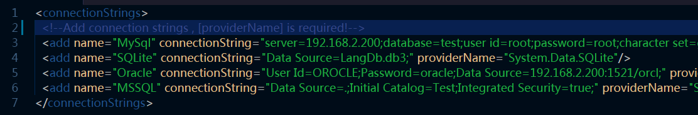

# DbModelTool
Author : Fallstar (fallstar0@qq.com)   
Home : [https://gitee.com/fallstar/ModelTool]('https://gitee.com/fallstar/ModelTool')

## Overview
A tool use to read table structures and description from multi-database, and generate POCO model file.   

About the origin of this tool :    
In my job I need to use Dapper as data access layer , it needs data models.

At first , I use EF(Entity Framework) to generate them. 

However , there are many tables have no primary key!

Then EF cannot work with it. 

Moreover , EF is not easy to add field commit on model.

So I create this tool ~o(∩_∩)o ~   

Develop Environment : **VS2019** **.NET 4.7.2**   

**:arrow_down:[Download](https://gitee.com/fallstar/ModelTool/releases)**

## Feature

- 1.Database Support : Oracle , SQLServer , SQLite ,MySql   

- 2.Multi Language Support, : Chinese and English built-in. Copy and modify the xml file in folder **Language** and restart the tool then you can see it!   

- 3.Use Razor engine to generate files, template file is **cshtml**. Isn't familary?! That is the same as  ASP.NET MVC! You can just copy and modify the cshtml file in **Templates** folder then you can use it!! 

- 4.Table and column commits will add to the model! (SQLite is not supported due to itself)

## Shot
### Option
You can see all configs in this page, like : languages , author ...
If you add your template , you can select it here.   
All model file will generate in default folder **Models**.

   

### Database
If you are the first time to run the tool ,you can find there is a new file **Db.config** generate in the folder.
Please open it and edit.

Follow the connection string examples and add the connection you want, you can see the connection you just added when you restart the tool.      

### Table
You can see the tables in the database you selected, choose the tables you want ,then press Next~

### Result
Press the Generate button , files will be generated~

## License

[Apache License v2.0](/LICENSE "Apache License v2.0")