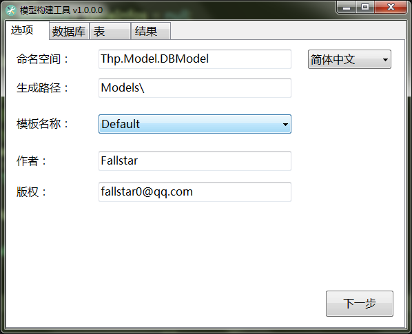
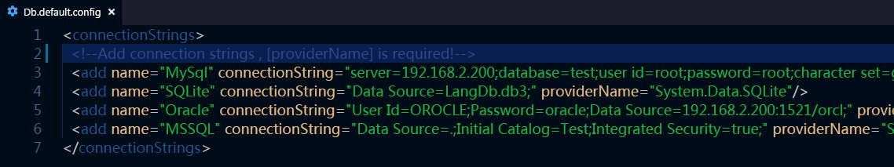
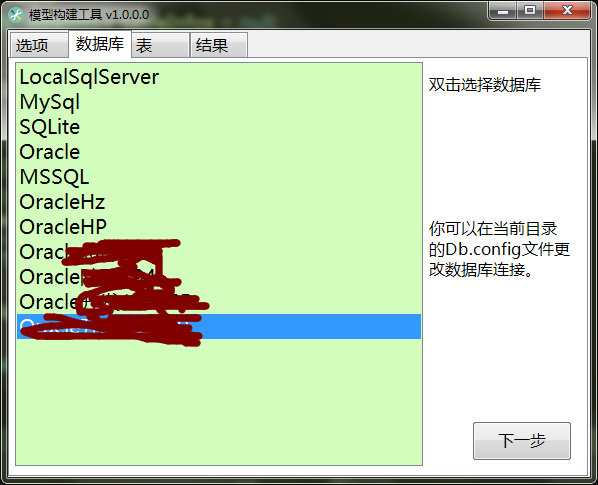
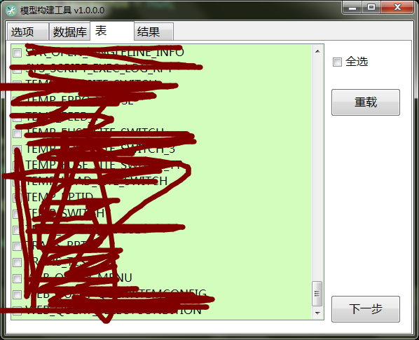
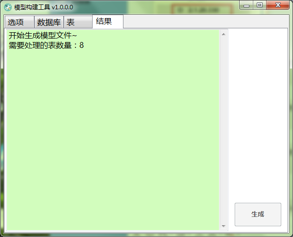

# DbModelTool 数据库模型工具
作者：Fallstar (fallstar0@qq.com)   
项目主页：[https://gitee.com/fallstar/ModelTool]('https://gitee.com/fallstar/ModelTool')

## 概要 (Overview)
一个用于从多种数据库读取表结构和注释信息的工具，并将这些信息生成简单的POCO模型。   

做这个工具的起因是因为在使用数据库访问类库为Dapper的时候，需要数据表模型，本来用EF也可以的，但是偏偏实际环境里面的好多表是没有主键的，然后EF就没戏了，另外EF导出的模型没有字段注释。   

于是这个工具就这么诞生了 o(∩_∩)o ~   

开发环境：**VS2019** **.NET 4.7.2**   

**:arrow_down:[点我下载]('https://gitee.com/fallstar/ModelTool/releases')**

## 特点 (Feature)

- 1.支持数据库：Oracle , SQLServer , SQLite ,MySql   

- 2.多语言支持，当前支持中文和英文，复制修改Language目录下面的文件即可实现更多语言支持，无需重新编译。   

- 3.使用Razor引擎来生成文件，模版为cshtml文件，是不是很眼熟？！这就是ASP.NET MVC的页面文件！你可以根据自己需要编写后放到 <code>Templates</code> 目录就可以用啦！！  

- 4.生成的模型字段上面有注释哦！(SQLite本身不能给字段和表加注释，所以没有这个功能)

## 功能截图 (Shot)
### 选项
你可以在这里配置生成出来的文件的一些重要信息。   
其中如果你做了新的模板，可以在模板名称那里选择。   
默认的文件生成路径是当前目录的 Models 文件夹里面。
   

### 数据库
如果你第一次运行，你会发现文件夹会多了一个 <code>Db.config</code> ，请打开它   

根据你的需要新增数据库连接，然后你可以在下面的界面里面看到对应的连接。      

### 表
你可以在这个界面看到这个数据库所拥有的表，选择你要导出的表，下一步~   

### 结果
点击生成就可以了~   

## License

[Apache License v2.0](/LICENSE "Apache License v2.0")